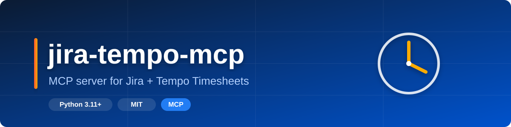

# jira-tempo-mcp



[](https://www.python.org/downloads/)
[](#license)
[](https://github.com/Korrnals/jira-tempo-mcp/pkgs/container/jira-tempo-mcp)

MCP server for **self-hosted Jira (Server / Data Center) + Tempo Timesheets 4**.
Track time, list worklogs, and generate weekly reports — all from your AI agent
(Copilot, Claude, etc.) via the Model Context Protocol.

> 📖 **Русская версия:** [README.ru.md](README.ru.md)

## 📚 Documentation

| Document | Description |
|----------|---------|
| [API Reference](docs/api.md) | Full MCP tool reference with parameters and examples |
| [Installation](docs/installation.md) | Setup and installation guide |
| [Configuration](docs/configuration.md) | Environment variables reference |
| [Reports](docs/reports.md) | Report formats (txt, md, json) and templates |
| [Templates](docs/templates.md) | Custom report templates reference (Jinja2 + Python) |
| [Architecture](docs/architecture.md) | Project architecture and design decisions |
| [CLI](docs/cli.md) | Command-line interface reference |
| [Troubleshooting](docs/troubleshooting.md) | Common issues and solutions |
| [MCP Integration](docs/mcp-integration.md) | Integration with MCP clients (VS Code, etc.) |
| [Deployment](docs/deployment.md) | Docker and deployment options |

---

## 📋 Features

| Tool | What it does |
| --- | --- |
| `list_worklogs` | List Tempo worklogs for a date range or single day |
| `get_worklog` | Get a single worklog by Tempo ID |
| `create_worklog` | Track time on a Jira issue with a comment |
| `delete_worklog` | Delete a worklog (undo mis-tracked time) |
| `get_issue` | Get Jira issue metadata (summary, status, project) |
| `list_favorite_issues` | List favorite issues for the current user |
| `search_users` | Search Jira users by name, surname, or username |
| `list_user_tasks` | Get tasks assigned to a Jira user with status, priority, comments |
| `generate_weekly_report` | Generate a weekly report (txt/md/json) from Tempo worklogs |
| `generate_team_report` | Generate a team report (txt/md/json) for multiple Jira users |
| `generate_tasks_report` | Generate a tasks report (md/txt/json) grouped by status |
| `list_report_templates` | List available report templates (builtin + custom) |

Since v0.2.0 the server supports **team reports** (per-user aggregation with
rate-limiting) and **custom report templates** (Jinja2 sandbox + opt-in Python).
Since v0.3.0 all report generators support **three output formats**: `txt`
(plain text), `md` (Markdown with tables and emojis), and `json` (structured
JSON). See [docs/reports.md](docs/reports.md) for details.

See [docs/api.md](docs/api.md) for the full tool reference with parameters and
examples.

---

## 🚀 Quick start

Get up and running in under a minute:

**Install (one command):**

```bash
curl -fsSL https://raw.githubusercontent.com/Korrnals/jira-tempo-mcp/main/scripts/install.sh | bash
```

This downloads and runs the interactive installer, which:

- ✅ Checks Python 3.11+ and pip
- ✅ Clones the repo and creates a venv
- ✅ Installs the package
- ✅ Guides you through Jira credentials setup
- ✅ Registers the MCP server in VS Code (user + workspace)
- ✅ Installs the standalone **JTM: Jira Tempo Reports** Copilot Chat agent by default (skip with `--no-agent`) — see [§JTM Agent](#-jtm-agent-standalone-copilot-chat-agent) for details

> 💡 **Tip:** The installer never requires `sudo` — everything lives in user space.
> It's idempotent: re-running updates without clobbering existing config.

**Uninstall:**

```bash
# Remove everything (MCP server + Copilot Chat agent + skill):
curl -fsSL https://raw.githubusercontent.com/Korrnals/jira-tempo-mcp/main/scripts/install.sh | bash -- --uninstall
# …or from a local clone:
python install.py uninstall

# Remove ONLY the Copilot Chat agent (keep the MCP server):
python install.py --uninstall-agent
```

The full uninstall removes the VS Code `mcp.json` entry, the Copilot Chat agent + skill + knowledge doc, and optionally the `.env.local` Jira credentials and the pip package (it asks before removing those). The agent-only removal leaves the MCP server fully functional — use it if you installed the agent but decided you do not want it.

**Docker:**

```bash
# Option A — docker run with an .env file (chmod 600, gitignored):
cp .env.example .env  # fill in JIRA_BASE_URL, JIRA_USER, JIRA_PAT
docker run -i --rm --env-file .env ghcr.io/korrnals/jira-tempo-mcp:0.3.2

# Option B — docker compose (uses docker-compose.yml at repo root):
docker compose up -d
docker compose logs -f jira-tempo-mcp
# drive the server via stdio:
docker compose run --rm -T jira-tempo-mcp
```

The image is published to ghcr for every release: `ghcr.io/korrnals/jira-tempo-mcp:<version>` and `:latest`. Pin to a version tag (e.g. `:0.3.2`) for reproducibility; use `:latest` to track the newest release.

> ⚠️ **Warning:** The install script URL works once the repository is public.
> Until then, clone manually and run `python install.py`.

---

<details>
<summary><b>🔧 From source (development)</b></summary>

The interactive installer creates a venv, writes `.env`, registers the MCP
server in VS Code, and optionally verifies Jira connectivity:

```bash
cd jira-tempo-mcp
python install.py
```

Or install from source:

```bash
git clone https://github.com/Korrnals/jira-tempo-mcp.git
cd jira-tempo-mcp
python -m venv .venv
source .venv/bin/activate
pip install -e ".[dev]"
jira-tempo-mcp serve
```

Or run via Docker:

```bash
docker run -i --rm \
  --env-file .env \
  ghcr.io/korrnals/jira-tempo-mcp:latest
```

Full installation paths: [docs/installation.md](docs/installation.md).

</details>

---

## ⚙️ Configuration

All configuration is via environment variables. Required:

| Variable | Description |
| --- | --- |
| `JIRA_BASE_URL` | Jira base URL (no trailing slash) |
| `JIRA_USER` | Jira username (login) |
| `JIRA_PAT` | Personal Access Token — 🔑 **never commit this** |

Optional: `JIRA_TIMEZONE`, `TEMPO_API_TOKEN`, `LOG_LEVEL`, `JIRA_HTTP_TIMEOUT`,
and report-related vars (`REPORT_*`).

Full reference: [docs/configuration.md](docs/configuration.md).

---

## 🔌 MCP integration

The server runs over **stdio** and is registered in VS Code `mcp.json`:

```json
{
  "servers": {
    "jira-tempo": {
      "command": "${workspaceFolder}/.venv/bin/python",
      "args": ["-m", "jira_tempo_mcp.server"],
      "envFile": "/home/your-username/.config/Code/User/.env.local",
      "env": {
        "JIRA_BASE_URL": "https://jira.example.com",
        "JIRA_USER": "your-username",
        "PYTHONPATH": "${workspaceFolder}/src"
      }
    }
  }
}
```

> 💡 **Tip:** Always use **absolute paths** for `envFile` — `~` does not work in
> sandboxed environments (distrobox, snap, containers).

Full guide: [docs/mcp-integration.md](docs/mcp-integration.md).

---

<details>
<summary><b>🖥️ CLI</b></summary>

```text
jira-tempo-mcp                  # start the MCP server (default)
jira-tempo-mcp serve            # start the MCP server
jira-tempo-mcp install          # interactive installer
jira-tempo-mcp uninstall        # reverse the installation
jira-tempo-mcp --version        # show version
```

Full reference: [docs/cli.md](docs/cli.md).

</details>

---

<details>
<summary><b>🔒 Security</b></summary>

- **🔑 Tokens never leave the local process** — `JIRA_PAT` is sent only to your
  Jira instance over HTTPS.
- **🛡️ TLS verification always on**, **HTTP redirects disabled**
  (`follow_redirects=False`) — prevents PAT leakage via redirect.
- **👁️ Tokens masked in logs** — `Config.__repr__` replaces `JIRA_PAT` with `***`.
- **✅ Input validation** — issue keys, dates, and `output_dir` (path traversal
  guard) are validated before any API call.
- **🐳 Docker** — multi-stage build, non-root user, secrets never baked in.

Full model: [docs/architecture.md#security](docs/architecture.md#security).

</details>

---

<details>
<summary><b>🛠️ Development</b></summary>

The canonical quality gate for this repo is the local `make` suite — GitHub
Actions are intentionally disabled here, so `make ci` is what every change
must pass before merge. It runs linting, type-checking, tests, and the build in
one command.

```sh
make ci         # full quality gate — lint + typecheck + test + build
make lint       # ruff
make typecheck  # mypy
make test       # pytest
make build      # python -m build (sdist + wheel)
```

</details>

---

## 🤖 JTM Agent (standalone Copilot Chat agent)

This repo ships a standalone AI agent that produces Jira/Tempo worklog reports predictably by calling the `jira-tempo` MCP generators. It is IDE-agnostic in its knowledge, with a thin VS Code Copilot Chat wrapper for one-click report generation.

### What installs where

`python install.py` installs the agent by default:
- `~/.copilot/agents/jtm-jira-tempo-reports.agent.md` — the VS Code Copilot Chat agent.
- `~/.copilot/agents/JTM_AGENT.md` — the universal knowledge doc (7-type report matrix, scenarios, rules), copied next to the agent.
- `~/.copilot/skills/jira-tempo-reports/SKILL.md` — the VS Code-specific skill (interactive picker flow).

A loud announcement block at the end of `install.py` confirms the install. To skip the agent: `python install.py --no-agent`. To remove only the agent: `python install.py --uninstall-agent`.

### VS Code Copilot Chat (one-click)

After install, open Copilot Chat, pick the agent **JTM: Jira Tempo Reports**, and click **📊 Недельный отчёт (по умолчанию)** for the one-click weekly report (basic + txt + current week + current user). The agent uses a graphical picker (`vscode_askQuestions`) for ambiguity resolution.

<details>
<summary><b>Other harnesses (Cursor, Claude Code, Continue, Aider) — click to expand</b></summary>

The universal knowledge doc `JTM_AGENT.md` (in `copilot-integration/`) is IDE-agnostic. Any MCP-capable agent reads it as context. Typical setup:

| Harness | MCP tools | Knowledge doc | Picker UI |
|---|---|---|---|
| VS Code Copilot Chat | auto-registered via `install.py` | auto-installed into `~/.copilot/agents/` | `vscode_askQuestions` (graphical) |
| Cursor | add `jira-tempo` to `.cursor/mcp.json` (same server entry as VS Code mcp.json) | point Cursor rules at `JTM_AGENT.md` | prose questions (no GUI picker) |
| Claude Code | add `jira-tempo` to `~/.claude/mcp.json` | reference `JTM_AGENT.md` in `CLAUDE.md` | prose questions |
| Continue | add `jira-tempo` to `~/.continue/config.json` MCP section | reference `JTM_AGENT.md` in config | prose questions |
| Aider / other MCP clients | per-client MCP config | pass `JTM_AGENT.md` as a context file (`--read JTM_AGENT.md` for Aider) | prose questions |

The MCP server entry for non-VS Code harnesses (copy from the VS Code mcp.json the installer writes):
```json
{
  "jira-tempo": {
    "command": "/path/to/your/venv/bin/python",
    "args": ["-m", "jira_tempo_mcp.server"],
    "env": { "PYTHONPATH": "/path/to/this/repo/src" }
  }
}
```
Point `PYTHONPATH` at this repo's `src/` so the package is importable. Provide `JIRA_BASE_URL`, `JIRA_USER`, `JIRA_PAT` via env vars or an env file per your harness.

</details>

### What the agent does NOT do

- Jira write operations (create/update issues or worklogs) — read-only.
- Analytics beyond raw worklog aggregation (trends, forecasting) — out of scope.
- Custom template authoring (writing `.py`/`.j2` template files) — out of scope.

See `JTM_AGENT.md` for the full 7-type report matrix, parameter semantics, and work scenarios.

---

##  License

MIT
