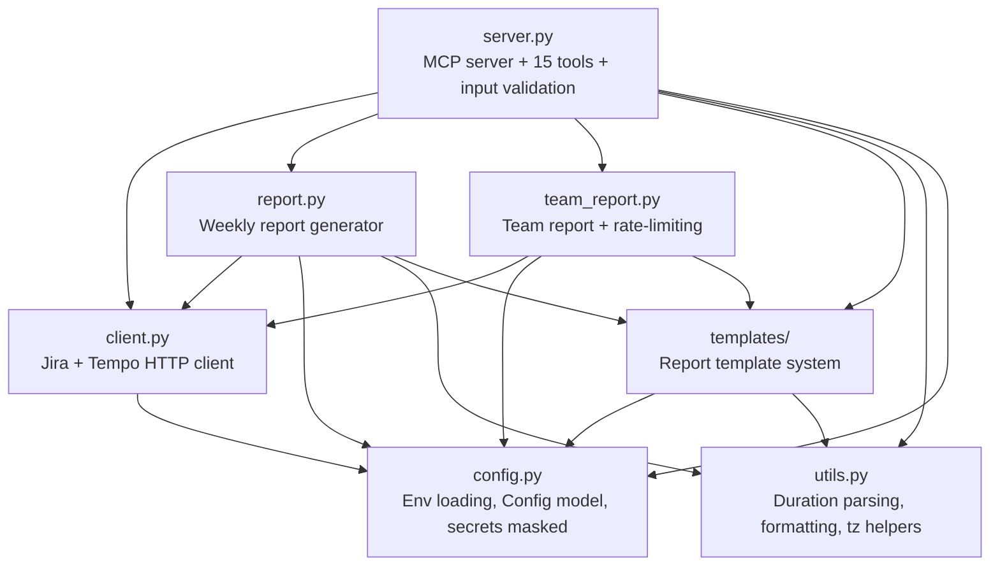
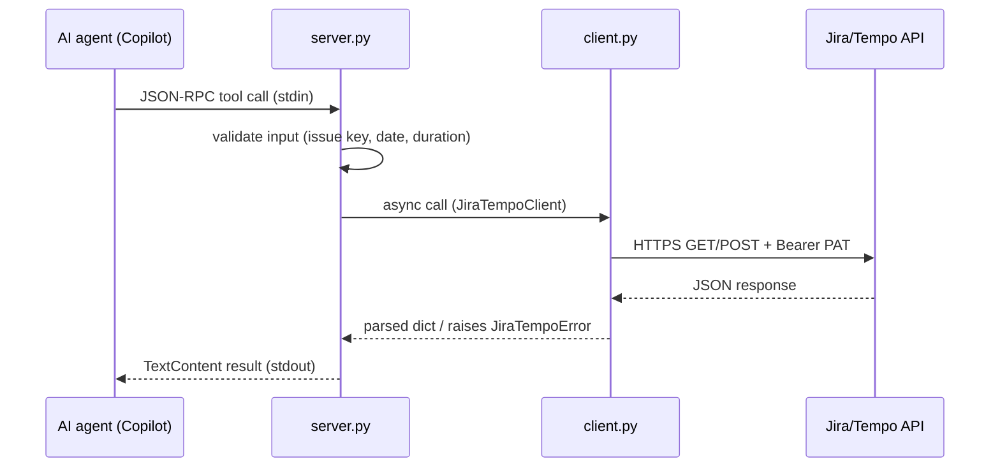

# 🏗️ Architecture

Layered design: each module has a single responsibility and dependencies
flow in one direction.

---

## 🏗️ Layers



| Layer | File | Responsibility |
| --- | --- | --- |
| MCP server | `server.py` | JSON-RPC over stdio, tool definitions, dispatch table, input validation, user-friendly errors |
| HTTP client | `client.py` | Jira REST API + Tempo Timesheets 4 API, PAT auth, TLS, no redirects, error redaction |
| Report generator | `report.py` | Weekly report: fetch worklogs, delegate rendering to the template system, write `.txt` |
| Team report | `team_report.py` | Team report: per-user worklog aggregation with semaphore-bounded concurrency and 429 retry |
| Templates | `templates/` | `ReportTemplate` protocol, `TemplateRegistry`, builtin templates, Jinja2 sandbox + Python opt-in loader |
| Config | `config.py` | Env loading via pydantic, `Config` model, secrets masked in `__repr__` |
| Utils | `utils.py` | Pure helpers: duration parsing, seconds→human formatting, timezone-aware `iso_now` |
| CLI | `cli.py` | Console entrypoint dispatcher (`serve` / `install` / `uninstall` / `--version`) |
| Installer | `install.py` | Interactive setup: venv, `.env`, VS Code `mcp.json` registration, connectivity check |

---

## 🔄 Data flow



1. The AI agent sends a JSON-RPC tool call over stdin.
2. `server.py` validates input (issue key regex, ISO date, duration tokens).
3. The handler calls `JiraTempoClient` (async `httpx`).
4. The client sends an HTTPS request with a Bearer PAT header.
5. On success, the parsed JSON is returned to the handler.
6. On error, `JiraTempoError` is raised with a redacted message.
7. The handler formats the result as a string and returns `TextContent`.

---

## ⚙️ Tool dispatch

Tools are registered in the `TOOLS` list and dispatched through a table:

```python
_TOOL_HANDLERS: dict[str, Any] = {
    "list_worklogs": _handle_list_worklogs,
    "get_worklog": _handle_get_worklog,
    "create_worklog": _handle_create_worklog,
    "delete_worklog": _handle_delete_worklog,
    "get_issue": _handle_get_issue,
    "list_favorite_issues": _handle_list_favorites,
    "generate_weekly_report": _handle_generate_report,
    "generate_team_report": _handle_generate_team_report,
    "list_report_templates": _handle_list_templates,
    "preview_report_template": _handle_preview_template,
    "search_users": _handle_search_users,
    "list_user_tasks": _handle_list_user_tasks,
    "list_issues_by_jql": _handle_list_issues_by_jql,
    "get_current_user": _handle_get_current_user,
    "generate_tasks_report": _handle_generate_tasks_report,
}
```

Each handler is an `async` function that receives `(arguments, config, client)`
and returns a string. Errors are caught in `_call_tool` and mapped to
user-friendly messages via `_user_friendly_error`.

---

## 🔒 Security

### 🔑 Token handling

- **Tokens never leave the local process.** `JIRA_PAT` is read from
  environment and sent only to the Jira instance over HTTPS.
- **`.env` is gitignored** and created with permissions `0600` on POSIX.
- **Tokens are masked in logs** — `Config.__repr__` replaces `JIRA_PAT`
  with `***`.
- **Error messages are redacted** — `_redact()` strips credentials from
  URLs before logging. API error bodies are truncated to 200 characters.
- The AI agent receives only the **result** of API calls, never the token.

### 🛡️ Transport hardening

- **TLS verification is always on** (`httpx.AsyncClient(verify=True)`).
- **HTTP redirects are disabled** (`follow_redirects=False`) — prevents
  PAT leakage via a redirect to an attacker-controlled host.
- **Configurable HTTP timeout** (`JIRA_HTTP_TIMEOUT`, default 30 s).

### ✅ Input validation

- **Jira issue keys** validated against `^[A-Z][A-Z0-9]+-\d+$`.
- **Dates** validated as ISO `YYYY-MM-DD`.
- **Report `output_dir`** checked against path traversal — the resolved
  path must be inside the allowed root (`REPORT_OUTPUT_DIR` or `./reports`).

### 🐳 Docker build safety

- `.dockerignore` excludes `.env`, `.env.*.local`, `.history/`, `.venv/`,
  `__pycache__/`, `.git/`, `tests/`.
- Multi-stage build — runtime image has only the installed wheel.
- Runs as non-root user `appuser` (UID 1001) with no shell.
- Secrets never baked into the image — passed at runtime via `--env-file`
  or a Kubernetes Secret.

> 💡 **Tip:** See [deployment.md](deployment.md) for Docker details.

---

## 🧪 Testing

Tests live in `tests/` (15 test files) and run under `pytest` with
`asyncio_mode = "auto"`:

| File | Covers |
| --- | --- |
| `test_config.py` | `Config` validation, env loading, secret masking |
| `test_config_diagnostics.py` | `ConfigError` messages, backend-specific remediation |
| `test_utils.py` | duration parsing, formatting, timezone helpers |
| `test_report.py` | report generation logic (unit) |
| `test_report_integration.py` | end-to-end report with mocked client |
| `test_team_report.py` | team report aggregation, concurrency, 429 retry |
| `test_tasks_report.py` | tasks report generation |
| `test_templates.py` | template registry, builtin templates |
| `test_templates_dx.py` | template developer experience (DX) helpers |
| `test_client_pagination.py` | client pagination, cursor handling |
| `test_security.py` | secret masking, redaction, path-traversal guards |
| `test_bugs_and_ux.py` | regression bugs and UX edge cases |
| `test_install.py` | installer flow (interactive) |
| `test_install_noninteractive.py` | installer `--non-interactive` path |
| `test_install_agent.py` | Copilot Chat agent install / uninstall |

The canonical CI gate is `make ci` — it runs `ruff check` + `ruff format
--check` + `mypy src/` + `pytest tests/ -v` on Python 3.12, mirroring what
the GitHub Actions `ci.yml` would run. **GitHub Actions are disabled in this
environment** (billing-locked), so a green `make ci` is the merge/release
signal. See [deployment.md](deployment.md#-cicd) for details.

---

## ➡️ Next steps

- 🌐 [api.md](api.md) — the 15 MCP tools
- 🐳 [deployment.md](deployment.md) — Docker, CI/CD, release
- ⚙️ [configuration.md](configuration.md) — env vars and secret handling
