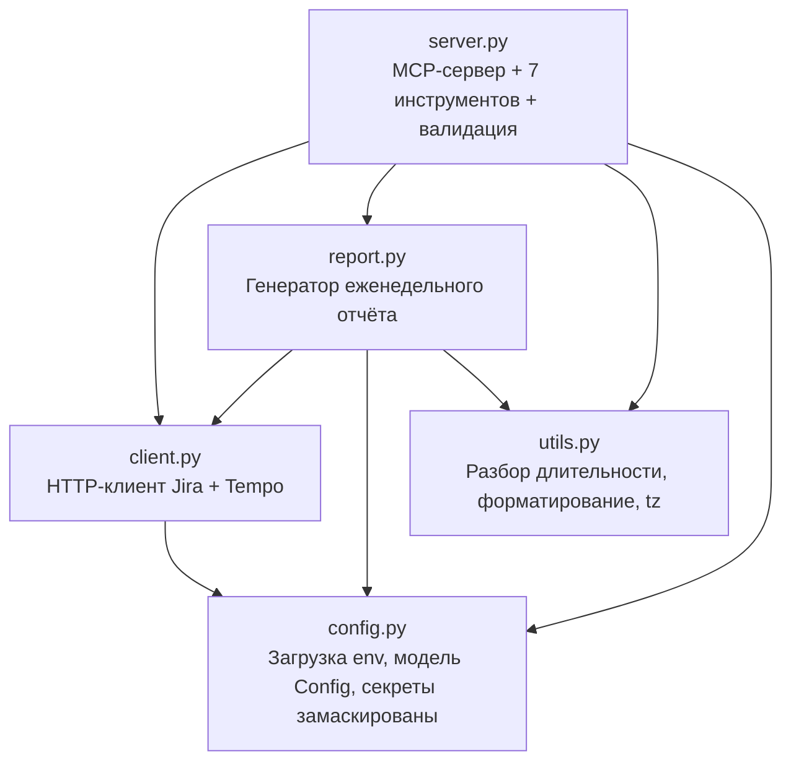
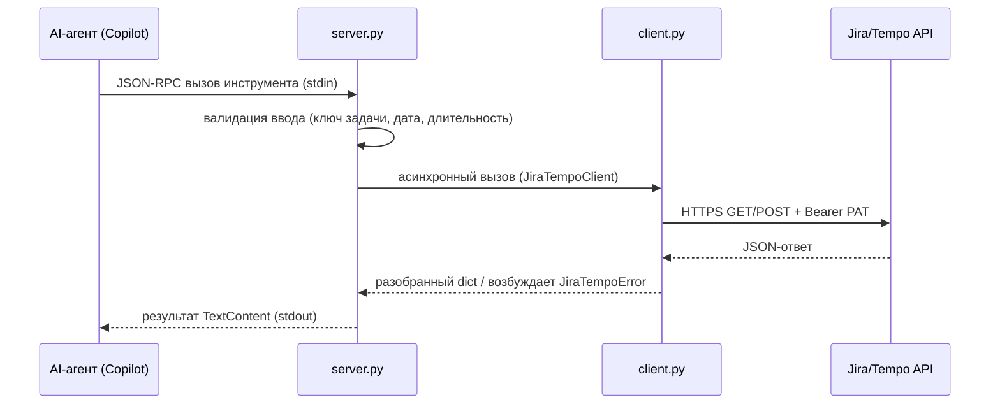

# Архитектура

Слоистая архитектура: каждый модуль несёт одну ответственность, зависимости
направлены в одну сторону.

## Слои



| Слой | Файл | Ответственность |
| --- | --- | --- |
| MCP-сервер | `server.py` | JSON-RPC через stdio, определения инструментов, таблица диспетчеризации, валидация ввода, пользовательские ошибки |
| HTTP-клиент | `client.py` | Jira REST API + Tempo Timesheets 4 API, авторизация PAT, TLS, без редиректов, редукция ошибок |
| Генератор отчётов | `report.py` | Шаблон еженедельного отчёта: выборка worklog'ов, группировка по задачам, маппинг секций, запись `.txt` |
| Конфиг | `config.py` | Загрузка env через pydantic, модель `Config`, секреты замаскированы в `__repr__` |
| Утилиты | `utils.py` | Чистые помощники: разбор длительности, секунды→человек, `iso_now` с учётом часового пояса |
| CLI | `cli.py` | Диспетчер консольной точки входа (`serve` / `install` / `uninstall` / `--version`) |
| Установщик | `install.py` | Интерактивная настройка: venv, `.env`, регистрация в VS Code `mcp.json`, проверка связи |

## Поток данных



1. AI-агент отправляет JSON-RPC вызов инструмента через stdin.
2. `server.py` валидирует ввод (регекс ключа задачи, ISO-дата, токены длительности).
3. Обработчик вызывает `JiraTempoClient` (асинхронный `httpx`).
4. Клиент отправляет HTTPS-запрос с заголовком Bearer PAT.
5. При успехе разобранный JSON возвращается в обработчик.
6. При ошибке возбуждается `JiraTempoError` с редуцированным сообщением.
7. Обработчик форматирует результат в строку и возвращает `TextContent`.

## Диспетчеризация инструментов

Инструменты регистрируются в списке `TOOLS` и диспетчеризуются через таблицу:

```python
_TOOL_HANDLERS: dict[str, Any] = {
    "list_worklogs": _handle_list_worklogs,
    "get_worklog": _handle_get_worklog,
    "create_worklog": _handle_create_worklog,
    "delete_worklog": _handle_delete_worklog,
    "get_issue": _handle_get_issue,
    "list_favorite_issues": _handle_list_favorites,
    "generate_weekly_report": _handle_generate_report,
}
```

Каждый обработчик — `async`-функция, принимающая `(arguments, config, client)`
и возвращающая строку. Ошибки перехватываются в `_call_tool` и
преобразуются в пользовательские сообщения через `_user_friendly_error`.

## Безопасность

### Обработка токенов

- **Токены не покидают локальный процесс.** `JIRA_PAT` читается из окружения
  и отправляется только на инстанс Jira через HTTPS.
- **`.env` в `.gitignore`** и создаётся с правами `0600` на POSIX.
- **Токены замаскированы в логах** — `Config.__repr__` заменяет `JIRA_PAT`
  на `***`.
- **Сообщения об ошибках редуцируются** — `_redact()` очищает URL от
  учётных данных перед логированием. Тела ошибок API обрезаются до 200 символов.
- AI-агент получает только **результат** вызовов API, никогда сам токен.

### Усиление транспорта

- **TLS-верификация всегда включена** (`httpx.AsyncClient(verify=True)`).
- **HTTP-редиректы отключены** (`follow_redirects=False`) — предотвращает
  утечку PAT через редирект на подконтрольный злоумышленнику хост.
- **Настраиваемый HTTP-таймаут** (`JIRA_HTTP_TIMEOUT`, по умолч. 30 с).

### Валидация ввода

- **Ключи задач Jira** проверяются по `^[A-Z][A-Z0-9]+-\d+$`.
- **Даты** проверяются как ISO `YYYY-MM-DD`.
- **`output_dir` отчёта** проверяется на path traversal — разрешённый путь
  должен быть внутри разрешённого корня (`REPORT_OUTPUT_DIR` или `./reports`).

### Безопасность сборки Docker

- `.dockerignore` исключает `.env`, `.env.*.local`, `.history/`, `.venv/`,
  `__pycache__/`, `.git/`, `tests/`.
- Многостадийная сборка — runtime-образ содержит только установленный wheel.
- Запуск от non-root пользователя `appuser` (UID 1001) без shell.
- Секреты никогда не вшиваются в образ — передаются при запуске через
  `--env-file` или Kubernetes Secret.

Подробнее о Docker — в [deployment.ru.md](deployment.ru.md).

## Тестирование

Тесты лежат в `tests/` и запускаются под `pytest` с `asyncio_mode = "auto"`:

| Файл | Покрывает |
| --- | --- |
| `test_config.py` | валидация `Config`, загрузка env, маскировка секретов |
| `test_utils.py` | разбор длительности, форматирование, помощники часового пояса |
| `test_report.py` | логика генерации отчёта (unit) |
| `test_report_integration.py` | end-to-end отчёт с замоканным клиентом |

CI прогоняет `ruff check` + `ruff format --check` + `mypy src/` + `pytest tests/ -v`
на Python 3.12. См. [deployment.ru.md](deployment.ru.md#cicd).

## Дальнейшие шаги

- [api.ru.md](api.ru.md) — 7 MCP-инструментов
- [deployment.ru.md](deployment.ru.md) — Docker, CI/CD, релизы
- [configuration.ru.md](configuration.ru.md) — переменные окружения и обработка секретов
