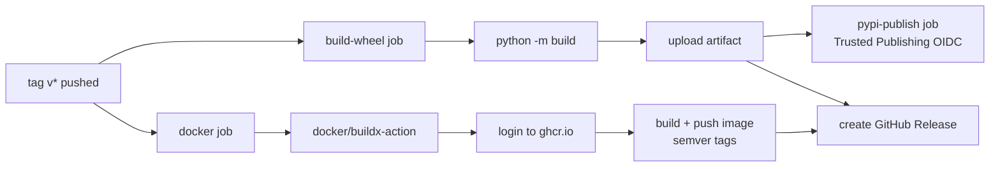

# Deployment

Docker build, CI/CD pipelines, and the release workflow.

## Docker

### Build the image locally

```bash
docker build -t jira-tempo-mcp .
```

The `Dockerfile` is a **multi-stage build**:

| Stage | Base | What happens |
| --- | --- | --- |
| `builder` | `python:3.12-slim` | Build a wheel, install it into a clean venv (no dev deps) |
| `runtime` | `python:3.12-slim` | Copy only the venv, run as non-root `appuser` (UID 1001) |

Runtime env: `PYTHONDONTWRITEBYTECODE=1`, `PYTHONUNBUFFERED=1`.

A `HEALTHCHECK` verifies the package is importable
(`python -c "import jira_tempo_mcp"`). There is no HTTP port to probe — the
server speaks stdio.

### Run the container

```bash
# stdio mode — pipe JSON-RPC in/out
docker run -i --rm \
  --env-file .env \
  jira-tempo-mcp

# or use the published image
docker run -i --rm \
  --env-file .env \
  ghcr.io/korrnals/jira-tempo-mcp:latest
```

### Required environment variables

Pass them via `--env-file` (a gitignored `.env`) or a Kubernetes Secret:

| Variable | Required | Description |
| --- | --- | --- |
| `JIRA_BASE_URL` | yes | Jira base URL (no trailing slash) |
| `JIRA_USER` | yes | Jira username |
| `JIRA_PAT` | yes | Personal Access Token |
| `JIRA_TIMEZONE` | no | IANA timezone (default `Europe/Moscow`) |
| `TEMPO_API_TOKEN` | no | Separate Tempo token (falls back to `JIRA_PAT`) |
| `LOG_LEVEL` | no | `DEBUG` / `INFO` / `WARNING` / `ERROR` |
| `JIRA_HTTP_TIMEOUT` | no | HTTP timeout in seconds (default `30.0`) |
| `REPORT_OUTPUT_DIR` | no | Base directory for reports (default `./reports`) |
| `REPORT_AUTHOR_NAME` | no | Author name in report header (default `JIRA_USER`) |
| `REPORT_SECTION_MAP` | no | JSON dict: issue key → section title |
| `REPORT_SECTION_MAP_FILE` | no | Path to a JSON file with the section mapping |
| `REPORT_FILENAME_PREFIX` | no | Prefix for report filenames (default `JIRA_USER`) |
| `REPORT_STABLE_ORDER` | no | JSON list: issue keys in stable order |
| `REPORT_NON_ISSUE_SECTIONS` | no | JSON list: non-issue section titles |

> **Never** bake `JIRA_PAT` into the image. The `.dockerignore` excludes
> `.env`, `.venv/`, `.history/`, and build artifacts from the build context.

See [configuration.md](configuration.md) for the full variable reference.

## CI/CD

The repo has two GitHub Actions workflows:

| Workflow | Trigger | What it does |
| --- | --- | --- |
| [`ci.yml`](../.github/workflows/ci.yml) | push / PR to `main` | `ruff check` + `ruff format --check` + `mypy src/` + `pytest tests/ -v` on Python 3.12 |
| [`release.yml`](../.github/workflows/release.yml) | git tag `v*` | Build wheel, build & push Docker image to `ghcr.io/korrnals/jira-tempo-mcp:<tag>`, create GitHub Release |

CI uses the ruff / mypy / pytest configuration from `pyproject.toml` — no
duplicated config. Pip dependencies are cached via `actions/setup-python`
keyed on `pyproject.toml`.

### CI pipeline detail

```mermaid
flowchart LR
    A[push / PR to main] --> B[checkout]
    B --> C[setup-python 3.12<br/>cache: pip]
    C --> D[pip install -e .[dev]]
    D --> E[ruff check]
    D --> F[ruff format --check]
    D --> G[mypy src/]
    D --> H[pytest tests/ -v]
```

Concurrency: `ci-${{ github.ref }}` with `cancel-in-progress: true` — a new
push cancels the previous run on the same branch.

## Release process

```bash
# 1. Bump version in pyproject.toml
# 2. Commit + push to main (CI must be green)
# 3. Tag and push
git tag v0.1.0
git push origin v0.1.0
```

The release workflow then runs automatically:

1. **Build wheel** — `python -m build` produces wheel + sdist, uploaded as a
   workflow artifact.
2. **Publish to PyPI** — the wheel is published to
   [pypi.org/project/jira-tempo-mcp](https://pypi.org/project/jira-tempo-mcp/)
   via Trusted Publishing (OIDC). No API token is stored in the repo.
3. **Build & push Docker image** — multi-stage build pushed to
   `ghcr.io/korrnals/jira-tempo-mcp` with semver tags (see
   [Docker image tags](#docker-image-tags)).
4. **Create GitHub Release** — auto-generated release notes with the wheel
   attached as a download asset.

### Release pipeline detail



Permissions required by `release.yml`:

| Permission | Why |
| --- | --- |
| `contents: write` | create GitHub Release + upload wheel asset |
| `packages: write` | push image to ghcr.io |
| `id-token: write` | PyPI Trusted Publishing (OIDC) — scoped to the `pypi-publish` job only |

### PyPI Trusted Publishing setup

The `pypi-publish` job uses **Trusted Publishing (OIDC)** — no long-lived API
token is stored in GitHub secrets. This is the recommended PyPI publishing
model.

To enable it for the first release:

1. Go to <https://pypi.org/manage/account/publishing/> (requires a PyPI
   account with 2FA enabled).
2. **Add a publisher** with:
   - Publisher: **GitHub**
   - Owner: `Korrnals`
   - Repository: `jira-tempo-mcp`
   - Workflow: `release.yml`
   - Environment: `pypi`
3. Save. The first `v*` tag push will publish to PyPI automatically.

> **First-release fallback:** if Trusted Publishing is not yet configured,
> you can temporarily use an API token. Add `PYPI_API_TOKEN` as a repository
> secret and switch the `pypi-publish` job to
> `password: ${{ secrets.PYPI_API_TOKEN }}`. Switch back to OIDC once the
> publisher is configured — tokens are a larger blast radius than OIDC.

### Docker image tags

The `docker/metadata-action` produces the following tags from a git tag:

| Git tag | Docker tags produced |
| --- | --- |
| `v0.1.0` | `0.1.0`, `0.1`, `0`, `latest` |
| `v0.2.3` | `0.2.3`, `0.2`, `0`, `latest` |
| `v0.1.0-rc.1` | `0.1.0-rc.1` (no `latest`, no semver short tags) |
| `v1.0.0` | `1.0.0`, `1.0`, `1`, `latest` |

Rules:

- `type=ref,event=tag` — the raw git tag (e.g. `v0.1.0`).
- `type=semver,pattern={{version}}` — full version (`0.1.0`).
- `type=semver,pattern={{major}}.{{minor}}` — minor track (`0.1`).
- `type=semver,pattern={{major}}` — major track (`0`).
- `type=raw,value=latest` — only when the tag has **no** `-` (pre-release
  tags like `v0.1.0-rc.1` do **not** get `latest`).

## Pre-commit hooks

The project ships a `.pre-commit-config.yaml` that runs lint and type
checks before every commit:

```bash
pip install -e ".[dev]"
pre-commit install
```

| Hook | What it does |
| --- | --- |
| `ruff check --fix` | Lint + autofix |
| `ruff format --check` | Verify formatting |
| `mypy src/` | Strict type check on `src/` |
| `trailing-whitespace` / `end-of-file-fixer` / `check-yaml` / `check-added-large-files` | Standard hygiene |

Bypass in an emergency: `git commit --no-verify` (use sparingly).

## Next steps

- [installation.md](installation.md) — local install paths
- [architecture.md](architecture.md#docker-build-safety) — Docker security model
- [configuration.md](configuration.md) — env vars for the container
