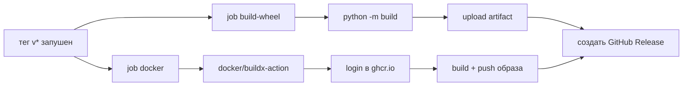

# Развёртывание

Сборка Docker, CI/CD-пайплайны и процесс релиза.

## Docker

### Локальная сборка образа

```bash
docker build -t jira-tempo-mcp .
```

`Dockerfile` — **многостадийная сборка**:

| Стадия | Базовый образ | Что происходит |
| --- | --- | --- |
| `builder` | `python:3.12-slim` | Сборка wheel, установка в чистый venv (без dev-зависимостей) |
| `runtime` | `python:3.12-slim` | Копируется только venv, запуск от non-root `appuser` (UID 1001) |

Окружение runtime: `PYTHONDONTWRITEBYTECODE=1`, `PYTHONUNBUFFERED=1`.

`HEALTHCHECK` проверяет импортируемость пакета
(`python -c "import jira_tempo_mcp"`). HTTP-порта нет — сервер работает
через stdio.

### Запуск контейнера

```bash
# режим stdio — прокидывайте JSON-RPC в/из
docker run -i --rm \
  --env-file .env \
  jira-tempo-mcp

# или опубликованный образ
docker run -i --rm \
  --env-file .env \
  ghcr.io/korrnals/jira-tempo-mcp:latest
```

### Обязательные переменные окружения

Передавайте через `--env-file` (gitignored `.env`) или Kubernetes Secret:

| Переменная | Обяз. | Описание |
| --- | --- | --- |
| `JIRA_BASE_URL` | да | Базовый URL Jira без слэша |
| `JIRA_USER` | да | Имя пользователя Jira |
| `JIRA_PAT` | да | Personal Access Token |
| `JIRA_TIMEZONE` | нет | Часовой пояс IANA (по умолч. `Europe/Moscow`) |
| `TEMPO_API_TOKEN` | нет | Отдельный токен Tempo (берётся `JIRA_PAT`) |
| `LOG_LEVEL` | нет | `DEBUG` / `INFO` / `WARNING` / `ERROR` |
| `JIRA_HTTP_TIMEOUT` | нет | HTTP-таймаут в секундах (по умолч. `30.0`) |
| `REPORT_OUTPUT_DIR` | нет | Базовая директория отчётов (по умолч. `./reports`) |
| `REPORT_AUTHOR_NAME` | нет | Имя автора в заголовке (по умолч. `JIRA_USER`) |
| `REPORT_SECTION_MAP` | нет | JSON-словарь: ключ задачи → секция |
| `REPORT_SECTION_MAP_FILE` | нет | Путь к JSON-файлу с маппингом секций |
| `REPORT_FILENAME_PREFIX` | нет | Префикс имён файлов (по умолч. `JIRA_USER`) |
| `REPORT_STABLE_ORDER` | нет | JSON-список ключей в стабильном порядке |
| `REPORT_NON_ISSUE_SECTIONS` | нет | JSON-список не-задачных секций |

> **Никогда** не вшивайте `JIRA_PAT` в образ. `.dockerignore` исключает
> `.env`, `.venv/`, `.history/` и артефакты сборки из контекста.

Полный справочник переменных — в [configuration.ru.md](configuration.ru.md).

## CI/CD

В репозитории два workflow GitHub Actions:

| Workflow | Триггер | Что делает |
| --- | --- | --- |
| [`ci.yml`](../.github/workflows/ci.yml) | push / PR в `main` | `ruff check` + `ruff format --check` + `mypy src/` + `pytest tests/ -v` на Python 3.12 |
| [`release.yml`](../.github/workflows/release.yml) | git-тег `v*` | Сборка wheel, сборка и push Docker-образа в `ghcr.io/korrnals/jira-tempo-mcp:<tag>`, создание GitHub Release |

CI использует конфигурацию ruff / mypy / pytest из `pyproject.toml` — без
дублирования. Зависимости pip кэшируются через `actions/setup-python` по
ключу `pyproject.toml`.

### Детали CI-пайплайна

```mermaid
flowchart LR
    A[push / PR в main] --> B[checkout]
    B --> C[setup-python 3.12<br/>cache: pip]
    C --> D[pip install -e .[dev]]
    D --> E[ruff check]
    D --> F[ruff format --check]
    D --> G[mypy src/]
    D --> H[pytest tests/ -v]
```

Конкурентность: `ci-${{ github.ref }}` с `cancel-in-progress: true` — новый
push отменяет предыдущий прогон на той же ветке.

## Процесс релиза

```bash
# 1. Поднять версию в pyproject.toml
# 2. Коммит + push в main (CI должен быть зелёным)
# 3. Тег и push
git tag v0.2.0
git push origin v0.2.0
```

Далее release-workflow:

1. Собирает wheel и sdist (`python -m build`).
2. Собирает Docker-образ и пушит его в
   `ghcr.io/korrnals/jira-tempo-mcp:v0.2.0` (и `:latest` для не-pre-release
   тегов).
3. Создаёт GitHub Release с автогенерированными заметками и wheel как
   вложение.

### Детали release-пайплайна



Права, требуемые `release.yml`:

| Право | Зачем |
| --- | --- |
| `contents: write` | создание GitHub Release + загрузка wheel |
| `packages: write` | push образа в ghcr.io |

## Pre-commit хуки

В проекте есть `.pre-commit-config.yaml`, запускающий линтер и
типизацию перед каждым коммитом:

```bash
pip install -e ".[dev]"
pre-commit install
```

| Хук | Что делает |
| --- | --- |
| `ruff check --fix` | Линт + автофикс |
| `ruff format --check` | Проверка форматирования |
| `mypy src/` | Строгая проверка типов по `src/` |
| `trailing-whitespace` / `end-of-file-fixer` / `check-yaml` / `check-added-large-files` | Стандартная гигиена |

Обход в экстренной ситуации: `git commit --no-verify` (используйте редко).

## Дальнейшие шаги

- [installation.ru.md](installation.ru.md) — способы локальной установки
- [architecture.ru.md](architecture.ru.md#безопасность-сборки-docker) — модель безопасности Docker
- [configuration.ru.md](configuration.ru.md) — переменные окружения для контейнера
