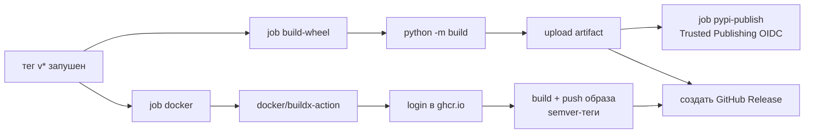

# 🐳 Развёртывание

Сборка Docker, CI/CD-пайплайны и процесс релиза.

---

## 🐳 Docker

### 🔧 Локальная сборка образа

```bash
docker build -t jira-tempo-mcp .
```

`Dockerfile` — **многостадийная сборка**:

| Стадия | Базовый образ | Что происходит |
| --- | --- | --- |
| `builder` | `python:3.12-slim` | Сборка wheel, установка в чистый venv (без dev-зависимостей) |
| `runtime` | `python:3.12-slim` | Копируется только venv, запуск от non-root `appuser` (UID 1001) |

> 💡 **Совет:** Окружение runtime: `PYTHONDONTWRITEBYTECODE=1`, `PYTHONUNBUFFERED=1`.
> `HEALTHCHECK` проверяет импортируемость пакета
> (`python -c "import jira_tempo_mcp"`). HTTP-порта нет — сервер работает
> через stdio.

### 🚀 Запуск контейнера

```bash
# режим stdio — прокидывайте JSON-RPC в/из
docker run -i --rm \
  --env-file .env \
  jira-tempo-mcp

# или опубликованный образ
docker run -i --rm \
  --env-file .env \
  ghcr.io/korrnals/jira-tempo-mcp:latest
```

### 🔑 Обязательные переменные окружения

Передавайте через `--env-file` (gitignored `.env`) или Kubernetes Secret:

| Переменная | Обяз. | Описание |
| --- | --- | --- |
| `JIRA_BASE_URL` | да | Базовый URL Jira без слэша |
| `JIRA_USER` | да | Имя пользователя Jira |
| `JIRA_PAT` | да | Personal Access Token |
| `JIRA_TIMEZONE` | нет | Часовой пояс IANA (по умолч. `Europe/Moscow`) |
| `TEMPO_API_TOKEN` | нет | Отдельный токен Tempo (берётся `JIRA_PAT`) |
| `LOG_LEVEL` | нет | `DEBUG` / `INFO` / `WARNING` / `ERROR` |
| `JIRA_HTTP_TIMEOUT` | нет | HTTP-таймаут в секундах (по умолч. `30.0`) |
| `REPORT_OUTPUT_DIR` | нет | Базовая директория отчётов (по умолч. `./reports`) |
| `REPORT_AUTHOR_NAME` | нет | Имя автора в заголовке (по умолч. `JIRA_USER`) |
| `REPORT_SECTION_MAP` | нет | JSON-словарь: ключ задачи → секция |
| `REPORT_SECTION_MAP_FILE` | нет | Путь к JSON-файлу с маппингом секций |
| `REPORT_FILENAME_PREFIX` | нет | Префикс имён файлов (по умолч. `JIRA_USER`) |
| `REPORT_STABLE_ORDER` | нет | JSON-список ключей в стабильном порядке |
| `REPORT_NON_ISSUE_SECTIONS` | нет | JSON-список не-задачных секций |

> ⚠️ **Внимание:** **Никогда** не вшивайте `JIRA_PAT` в образ. `.dockerignore`
> исключает `.env`, `.venv/`, `.history/` и артефакты сборки из контекста.

Полный справочник переменных — в [configuration.ru.md](configuration.ru.md).

---

## 🔄 CI/CD

В репозитории два workflow GitHub Actions:

| Workflow | Триггер | Что делает |
| --- | --- | --- |
| [`ci.yml`](../.github/workflows/ci.yml) | push / PR в `main` | `ruff check` + `ruff format --check` + `mypy src/` + `pytest tests/ -v` на Python 3.12 |
| [`release.yml`](../.github/workflows/release.yml) | git-тег `v*` | Сборка wheel, сборка и push Docker-образа в `ghcr.io/korrnals/jira-tempo-mcp:<tag>`, создание GitHub Release |

> 💡 **Совет:** CI использует конфигурацию ruff / mypy / pytest из `pyproject.toml`
> — без дублирования. Зависимости pip кэшируются через `actions/setup-python` по
> ключу `pyproject.toml`.

> ⚠️ **Внимание — Actions отключены в этом окружении:** описанные выше workflow
> **намеренно отключены** (биллинг GitHub Actions заблокирован, раннеры
> `runs-on: self-hosted` не развёрнуты — поэтому ни `ci.yml`, ни `release.yml`
> не запускаются ни при push, ни по тегу `v*`). **Каноническая CI-проверка —
> `make ci`**: локально запускает `ruff` + `mypy` + `pytest` и повторяет то, что
> делал бы `ci.yml`. Сигнал к merge/релизу — зелёный `make ci`, а не зелёная
> отметка Actions.

### 📊 Детали CI-пайплайна

```mermaid
flowchart LR
    A[push / PR в main] --> B[checkout]
    B --> C[setup-python 3.12<br/>cache: pip]
    C --> D[pip install -e .[dev]]
    D --> E[ruff check]
    D --> F[ruff format --check]
    D --> G[mypy src/]
    D --> H[pytest tests/ -v]
```

> 💡 **Совет:** Конкурентность: `ci-${{ github.ref }}` с `cancel-in-progress: true`
> — новый push отменяет предыдущий прогон на той же ветке.

---

## 🏷️ Процесс релиза

```bash
# 1. Поднять версию в pyproject.toml
# 2. Коммит + push в main (CI должен быть зелёным)
# 3. Тег и push
git tag v0.4.1
git push origin v0.4.1
```

Далее release-workflow запускается автоматически:

1. 📦 **Сборка wheel** — `python -m build` создаёт wheel + sdist, загружается
   как артефакт workflow.
2. 📤 **Публикация в PyPI** — wheel публикуется в
   [pypi.org/project/jira-tempo-mcp](https://pypi.org/project/jira-tempo-mcp/)
   через Trusted Publishing (OIDC). API-токен не хранится в репозитории.
3. 🐳 **Сборка и push Docker-образа** — многостадийная сборка пушится в
   `ghcr.io/korrnals/jira-tempo-mcp` с semver-тегами (см.
   [Теги Docker-образа](#-теги-docker-образа)).
4. 📝 **Создание GitHub Release** — автогенерированные заметки с wheel как
   вложением.

> ⚠️ **Внимание — публикация в PyPI сейчас отключена:** job `pypi-publish` в
> `release.yml` защищён `if: false` (см. комментарий `# DISABLED`), а runtime
> Actions в этом окружении и так отключён. **Пакет не публикуется в PyPI**, поэтому
> `pip install jira-tempo-mcp` завершится ошибкой. Пока Trusted Publishing не
> настроен, а Actions не включены, релизы выходят только как GitHub Release +
> Docker-образ в `ghcr.io`; ставьте из исходников или через Docker (см.
> [installation.ru.md](installation.ru.md)).

### 📊 Детали release-пайплайна



### 🔐 Права, требуемые `release.yml`

| Право | Зачем |
| --- | --- |
| `contents: write` | создание GitHub Release + загрузка wheel |
| `packages: write` | push образа в ghcr.io |
| `id-token: write` | PyPI Trusted Publishing (OIDC) — ограничено job `pypi-publish` |

---

### 🔑 Настройка PyPI Trusted Publishing

Job `pypi-publish` использует **Trusted Publishing (OIDC)** — долгоживущий
API-токен не хранится в секретах GitHub. Это рекомендуемая модель публикации
в PyPI.

Для включения перед первым релизом:

1. Зайдите на <https://pypi.org/manage/account/publishing/> (нужен аккаунт
   PyPI с включённой 2FA).
2. **Add a publisher** с параметрами:
   - Publisher: **GitHub**
   - Owner: `Korrnals`
   - Repository: `jira-tempo-mcp`
   - Workflow: `release.yml`
   - Environment: `pypi`
3. Сохраните. Первый push тега `v*` опубликует пакет в PyPI автоматически.

> ⚠️ **Внимание — fallback для первого релиза:** если Trusted Publishing ещё не
> настроен, можно временно использовать API-токен. Добавьте `PYPI_API_TOKEN` как
> секрет репозитория и переключите job `pypi-publish` на
> `password: ${{ secrets.PYPI_API_TOKEN }}`. После настройки publisher
> вернитесь к OIDC — токен имеет больший blast radius, чем OIDC.

---

### 🏷️ Теги Docker-образа

`docker/metadata-action` создаёт следующие теги из git-тега:

| Git-тег | Docker-теги |
| --- | --- |
| `v0.1.0` | `0.1.0`, `0.1`, `0`, `latest` |
| `v0.2.3` | `0.2.3`, `0.2`, `0`, `latest` |
| `v0.1.0-rc.1` | `0.1.0-rc.1` (без `latest`, без коротких semver-тегов) |
| `v1.0.0` | `1.0.0`, `1.0`, `1`, `latest` |

Правила:

- `type=ref,event=tag` — raw git-тег (например `v0.1.0`).
- `type=semver,pattern={{version}}` — полная версия (`0.1.0`).
- `type=semver,pattern={{major}}.{{minor}}` — минорный трек (`0.1`).
- `type=semver,pattern={{major}}` — мажорный трек (`0`).
- `type=raw,value=latest` — только если в теге **нет** `-` (pre-release-теги
  вида `v0.1.0-rc.1` **не** получают `latest`).

---

## 🪝 Pre-commit хуки

В проекте есть `.pre-commit-config.yaml`, запускающий линтер и
типизацию перед каждым коммитом:

```bash
pip install -e ".[dev]"
pre-commit install
```

| Хук | Что делает |
| --- | --- |
| `ruff check --fix` | Линт + автофикс |
| `ruff format --check` | Проверка форматирования |
| `mypy src/` | Строгая проверка типов по `src/` |
| `trailing-whitespace` / `end-of-file-fixer` / `check-yaml` / `check-added-large-files` | Стандартная гигиена |

> ⚠️ **Внимание:** Обход в экстренной ситуации: `git commit --no-verify` (используйте редко).

---

## ➡️ Дальнейшие шаги

- 📦 [installation.ru.md](installation.ru.md) — способы локальной установки
- 🏗️ [architecture.ru.md](architecture.ru.md#-безопасность-сборки-docker) — модель безопасности Docker
- ⚙️ [configuration.ru.md](configuration.ru.md) — переменные окружения для контейнера
