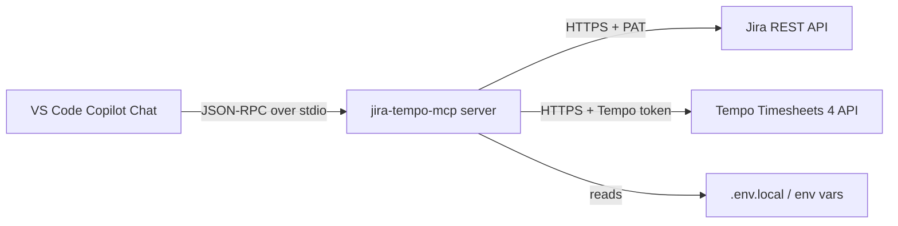

# 🔌 MCP integration

How `jira-tempo-mcp` plugs into VS Code Copilot Chat via the Model Context
Protocol.

---

## 🏗️ How it works



The MCP server runs as a child process of VS Code. It speaks JSON-RPC over
stdio (stdin/stdout); logs go to stderr. VS Code discovers it through an
entry in `mcp.json`.

---

## 👤 User-level config — `~/.config/Code/User/mcp.json`

The installer (`python install.py`) registers the server here automatically.
Manual equivalent on Linux:

```json
{
  "servers": {
    "jira-tempo": {
      "command": "/home/your-username/projects/jira-tempo-mcp/.venv/bin/python",
      "args": ["-m", "jira_tempo_mcp.server"],
      "envFile": "/home/your-username/.config/Code/User/.env.local",
      "env": {
        "JIRA_BASE_URL": "https://jira.example.com",
        "JIRA_USER": "your-username",
        "JIRA_TIMEZONE": "Europe/Moscow",
        "LOG_LEVEL": "INFO",
        "PYTHONPATH": "/home/your-username/projects/jira-tempo-mcp/src"
      }
    }
  }
}
```

> 💡 **Tip:** On macOS the path is `~/Library/Application Support/Code/User/mcp.json`;
> on Windows `%APPDATA%\Code\User\mcp.json`.

---

## 📁 Workspace-level config — `.vscode/mcp.json`

The installer also writes a workspace-level `.vscode/mcp.json` that uses
`${workspaceFolder}` variables so the config is portable across machines:

```json
{
  "servers": {
    "jira-tempo": {
      "command": "${workspaceFolder}/.venv/bin/python",
      "args": ["-m", "jira_tempo_mcp.server"],
      "envFile": "/home/your-username/.config/Code/User/.env.local",
      "env": {
        "PYTHONPATH": "${workspaceFolder}/src"
      }
    }
  }
}
```

`${workspaceFolder}` resolves to the project root at runtime. Non-secret
env vars (`JIRA_BASE_URL`, `JIRA_USER`, …) are injected from the user-level
config or `.env.local`.

---

## 🔑 `envFile` — single `.env.local` for secrets

The recommended pattern: keep all MCP-server secrets in one
`~/.config/Code/User/.env.local` and reference it via `envFile`:

```bash
# ~/.config/Code/User/.env.local
JIRA_PAT=your_personal_access_token_here
TEMPO_API_TOKEN=your_tempo_token_here
```

VS Code MCP-host loads this file and injects the variables into the server
process environment. This keeps secrets out of `mcp.json` (which may be
committed) and out of shell history.

### ⚠️ Absolute paths for `envFile` (distrobox / containers)

**Always use absolute paths for `envFile`.** The `~` shortcut does not work
in sandboxed environments (distrobox, snap, flatpak, containers) because
VS Code MCP-host resolves `~` against its own root namespace, not the
user's `$HOME`.

| Environment | Wrong | Right |
| --- | --- | --- |
| Native Linux | `~/.config/Code/User/.env.local` | `/home/your-username/.config/Code/User/.env.local` |
| distrobox | `~/.config/Code/User/.env.local` | `/var/home/your-username/.distrobox/box/home/.config/Code/User/.env.local` |
| macOS | `~/.config/…` | `/Users/your-username/.config/…` |

> 🐛 **Symptom of the bug:** `Failed to read envFile '~/...'` in the MCP panel,
> and the server does not start.

---

## 🌐 `${input:...}` for HTTP-type servers

Some MCP servers (e.g. the GitHub MCP server) use the `http` type and
require secrets in HTTP headers. The `${env:VAR}` substitution does **not**
work inside `headers` for HTTP-type servers — VS Code returns
`400 Authorization header badly formatted`.

Use `${input:...}` instead, which prompts the user once and caches the
value in the VS Code secret storage:

```json
{
  "servers": {
    "github": {
      "type": "http",
      "url": "https://api.githubcopilot.com/mcp/",
      "headers": {
        "Authorization": "Bearer ${input:github_token}"
      },
      "inputs": [
        {
          "id": "github_token",
          "type": "promptString",
          "description": "GitHub PAT (classic) with repo scope",
          "password": true
        }
      ]
    }
  }
}
```

> 💡 **Tip:** `jira-tempo-mcp` is a **stdio** server, so it uses `envFile` + `env`,
> not `${input:...}`. The `${input:...}` pattern is documented here for users
> who run multiple MCP servers side by side.

---

## 📁 `${workspaceFolder}` variables

| Variable | Resolves to |
| --- | --- |
| `${workspaceFolder}` | Project root (where `.vscode/` lives) |
| `${workspaceFolderBasename}` | Project folder name only |

Use these in workspace-level `.vscode/mcp.json` so the config is portable.
Avoid them in user-level `mcp.json` — there is no workspace context at
that scope.

---

## 🐛 Troubleshooting MCP startup

| Symptom | Cause | Fix |
| --- | --- | --- |
| Server not in MCP panel | VS Code did not reload | Ctrl+Shift+P → Developer: Reload Window |
| `Failed to read envFile '~/...'` | `~` not resolved in sandbox | use absolute path |
| `ModuleNotFoundError: No module named 'pytz'` | venv not activated / wrong python | use `${workspaceFolder}/.venv/bin/python` |
| `JIRA_BASE_URL or JIRA_PAT missing` | `.env.local` not loaded | check `envFile` path and contents |
| `401 Unauthorized` | invalid or expired PAT | rotate the PAT in Jira |
| `400 Authorization header badly formatted` | `${env:...}` in HTTP headers | use `${input:...}` |

See [troubleshooting.md](troubleshooting.md) for the full list.

---

## ➡️ Next steps

- 🌐 [api.md](api.md) — MCP tools reference
- ⚙️ [configuration.md](configuration.md) — all environment variables
- 🐛 [troubleshooting.md](troubleshooting.md) — common errors
