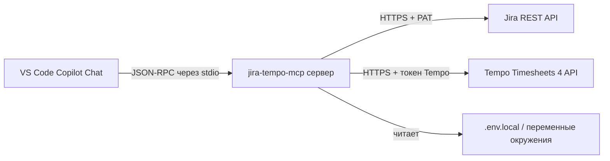

# 🔌 MCP-интеграция

Как `jira-tempo-mcp` подключается к VS Code Copilot Chat через Model Context
Protocol.

---

## 🏗️ Как это работает



MCP-сервер запускается как дочерний процесс VS Code. Он говорит на JSON-RPC
через stdio (stdin/stdout); логи идут в stderr. VS Code находит его через
запись в `mcp.json`.

---

## 👤 Конфиг уровня пользователя — `~/.config/Code/User/mcp.json`

Установщик (`python install.py`) регистрирует сервер здесь автоматически.
Ручной аналог на Linux:

```json
{
  "servers": {
    "jira-tempo": {
      "command": "/home/your-username/projects/jira-tempo-mcp/.venv/bin/python",
      "args": ["-m", "jira_tempo_mcp.server"],
      "envFile": "/home/your-username/.config/Code/User/.env.local",
      "env": {
        "JIRA_BASE_URL": "https://jira.example.com",
        "JIRA_USER": "your-username",
        "JIRA_TIMEZONE": "Europe/Moscow",
        "LOG_LEVEL": "INFO",
        "PYTHONPATH": "/home/your-username/projects/jira-tempo-mcp/src"
      }
    }
  }
}
```

> 💡 **Совет:** На macOS путь `~/Library/Application Support/Code/User/mcp.json`;
> на Windows `%APPDATA%\Code\User\mcp.json`.

---

## 📁 Конфиг уровня workspace — `.vscode/mcp.json`

Установщик также записывает workspace-уровневый `.vscode/mcp.json` с
переменными `${workspaceFolder}`, чтобы конфиг был переносимым между
машинами:

```json
{
  "servers": {
    "jira-tempo": {
      "command": "${workspaceFolder}/.venv/bin/python",
      "args": ["-m", "jira_tempo_mcp.server"],
      "envFile": "/home/your-username/.config/Code/User/.env.local",
      "env": {
        "PYTHONPATH": "${workspaceFolder}/src"
      }
    }
  }
}
```

`${workspaceFolder}` разворачивается в корень проекта при запуске.
Не-секретные переменные (`JIRA_BASE_URL`, `JIRA_USER`, …) подставляются из
конфига уровня пользователя или `.env.local`.

---

## 🔑 `envFile` — единый `.env.local` для секретов

Рекомендуемый паттерн: хранить секреты всех MCP-серверов в одном
`~/.config/Code/User/.env.local` и ссылаться на него через `envFile`:

```bash
# ~/.config/Code/User/.env.local
JIRA_PAT=your_personal_access_token_here
TEMPO_API_TOKEN=your_tempo_token_here
```

VS Code MCP-host загружает этот файл и подставляет переменные в окружение
процесса сервера. Так секреты не попадают в `mcp.json` (который может
коммититься) и в историю shell.

### ⚠️ Абсолютные пути для `envFile` (distrobox / контейнеры)

**Всегда используйте абсолютные пути для `envFile`.** Сокращение `~` не
работает в sandbox-окружениях (distrobox, snap, flatpak, контейнеры), так
как VS Code MCP-host разворачивает `~` относительно своего root-namespace,
а не `$HOME` пользователя.

| Окружение | Неправильно | Правильно |
| --- | --- | --- |
| Нативный Linux | `~/.config/Code/User/.env.local` | `/home/your-username/.config/Code/User/.env.local` |
| distrobox | `~/.config/Code/User/.env.local` | `/var/home/your-username/.distrobox/box/home/.config/Code/User/.env.local` |
| macOS | `~/.config/…` | `/Users/your-username/.config/…` |

> 🐛 **Симптом бага:** `Failed to read envFile '~/...'` в MCP-панели, сервер не
> стартует.

---

## 🌐 `${input:...}` для HTTP-серверов

Некоторые MCP-серверы (например, GitHub MCP) используют тип `http` и
требуют секреты в HTTP-заголовках. Подстановка `${env:VAR}` **не работает**
внутри `headers` для HTTP-серверов — VS Code возвращает
`400 Authorization header badly formatted`.

Используйте `${input:...}` — он один раз запрашивает значение у
пользователя и кэширует его в секретном хранилище VS Code:

```json
{
  "servers": {
    "github": {
      "type": "http",
      "url": "https://api.githubcopilot.com/mcp/",
      "headers": {
        "Authorization": "Bearer ${input:github_token}"
      },
      "inputs": [
        {
          "id": "github_token",
          "type": "promptString",
          "description": "GitHub PAT (classic) с scope repo",
          "password": true
        }
      ]
    }
  }
}
```

> 💡 **Совет:** `jira-tempo-mcp` — **stdio**-сервер, поэтому использует
> `envFile` + `env`, а не `${input:...}`. Паттерн `${input:...}` описан здесь
> для пользователей, которые запускают несколько MCP-серверов рядом.

---

## 📁 Переменные `${workspaceFolder}`

| Переменная | Разворачивается в |
| --- | --- |
| `${workspaceFolder}` | Корень проекта (где лежит `.vscode/`) |
| `${workspaceFolderBasename}` | Только имя папки проекта |

Используйте их в workspace-уровневом `.vscode/mcp.json` для переносимости.
Избегайте их в user-level `mcp.json` — там нет контекста workspace.

---

## 🐛 Решение проблем запуска MCP

| Симптом | Причина | Решение |
| --- | --- | --- |
| Сервера нет в MCP-панели | VS Code не перезагрузился | Ctrl+Shift+P → Developer: Reload Window |
| `Failed to read envFile '~/...'` | `~` не разворачивается в sandbox | используйте абсолютный путь |
| `ModuleNotFoundError: No module named 'pytz'` | venv не активирован / неверный python | используйте `${workspaceFolder}/.venv/bin/python` |
| `JIRA_BASE_URL or JIRA_PAT missing` | `.env.local` не загружен | проверьте путь `envFile` и содержимое |
| `401 Unauthorized` | невалидный или истёкший PAT | перевыпустите PAT в Jira |
| `400 Authorization header badly formatted` | `${env:...}` в HTTP-заголовках | используйте `${input:...}` |

Полный список — в [troubleshooting.ru.md](troubleshooting.ru.md).

---

## ➡️ Дальнейшие шаги

- 🌐 [api.ru.md](api.ru.md) — справочник MCP-инструментов
- ⚙️ [configuration.ru.md](configuration.ru.md) — все переменные окружения
- 🐛 [troubleshooting.ru.md](troubleshooting.ru.md) — частые ошибки
